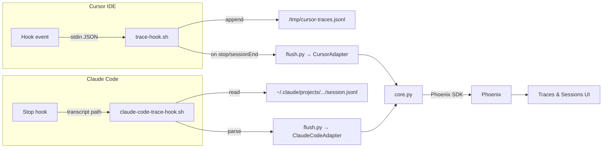

# coding-agent-insights

[](https://github.com/mazzucci/coding-agent-insights/actions/workflows/ci.yml)
[](LICENSE)
[](https://www.python.org/downloads/)

Session tracing and observability for AI coding agents, powered by [Phoenix](https://github.com/Arize-ai/phoenix).

Every agent interaction — prompts, tool calls, file edits, shell commands, thinking steps — is captured automatically and sent to Phoenix for search, replay, and analysis.

## Supported agents

| Agent | Mechanism | Status |
|---|---|---|
| **Cursor** | Hook events → JSONL buffer → flush on session end | ✅ Stable |
| **Claude Code** | Stop hook → JSONL transcript parser → flush | ✅ New |

Both agents produce **identical span structures** in Phoenix — same trace hierarchy, same attributes, same OpenInference conventions. You can compare sessions across agents in a single Phoenix project.

## How it works



### Cursor

**Hot path (~5 ms):** Every Cursor hook event is piped to `trace-hook.sh`, which appends the raw JSON to a local buffer file.

**Flush (on session end):** When a session ends, `flush.py` runs in the background. The Cursor adapter reads the buffer, normalises events, and hands them to the core engine for span construction and Phoenix export.

### Claude Code

**Stop hook:** Claude Code's `Stop` hook fires after each agent turn. The hook script extracts the `transcript_path` from the hook context and passes it to `flush.py`.

**Transcript parsing:** The Claude Code adapter reads the JSONL transcript, parses user messages, assistant content blocks (text, thinking, tool_use), and tool results into normalised events. Tool use/result pairs are linked automatically.

### Shared core

Both adapters produce `NormalizedEvent` objects that the core engine processes uniformly: turn assignment, span building with monotonic timestamps, parent-child relationships, and Phoenix export using [OpenInference](https://github.com/Arize-ai/openinference) semantic conventions.

**Result:** Each conversation turn becomes a separate trace in Phoenix. All turns from the same session are grouped together, giving you a full conversational thread view — regardless of which agent generated them.

## What gets captured

### Cursor

| Hook event | Span name | Content |
|---|---|---|
| `sessionStart` | `session` | Composer mode, background agent flag |
| `beforeSubmitPrompt` | *(first 120 chars of prompt)* | Full prompt text, attachments |
| `afterAgentThought` | `thinking` | Agent's reasoning text |
| `postToolUse` | `tool:<name>` | Tool input and output |
| `postToolUseFailure` | `tool:<name>.error` | Error message, failure type |
| `afterShellExecution` | `shell` | Command and output |
| `afterMCPExecution` | `mcp:<name>` | MCP tool input and result |
| `afterFileEdit` | `edit:<filename>` | File path and edits |
| `afterAgentResponse` | `response` | Agent's final response |
| `preCompact` | `compaction` | Context usage stats |
| `subagentStop` | `subagent:<type>` | Task, summary, tool count |
| `stop` / `sessionEnd` | `session.end` | Status, reason, duration |

### Claude Code

| Content block | Span name | Content |
|---|---|---|
| User message | *(first 120 chars of prompt)* | Full prompt text |
| `thinking` | `thinking` | Model reasoning text |
| `tool_use` + `tool_result` | `tool:<name>` | Tool input, output, duration |
| `text` (assistant) | `response` | Final response text |
| Summary | `session.end` | Session summary |

## Quick start

### Prerequisites

- **macOS or Linux**
- **Docker** (for local Phoenix — optional if you have an existing instance)

`uv` is installed automatically if not already present.

### Install

```bash
git clone https://github.com/mazzucci/coding-agent-insights.git
cd coding-agent-insights
bash install.sh
```

The installer will:

1. Install `uv` if needed
2. **Auto-detect** Cursor (`~/.cursor/`) and/or Claude Code (`~/.claude/`)
3. Copy hook scripts and configure each detected agent
4. Ask how you want to connect to Phoenix:
   - **Local Docker** — spins up Phoenix v13.15.0 (with gRPC on port 4317)
   - **Existing URL** — connects to your Phoenix instance
   - **Skip** — configure later
5. Ask for a Phoenix project name (default: `coding-agent-insights`)

After install, both agents will trace sessions automatically.

### Verify

Open Phoenix at [http://localhost:6006](http://localhost:6006), start an agent conversation, and watch traces appear in the project.

## Configuration

Settings are in `.coding-agent-insights.env` in each agent's hooks directory:

```bash
PHOENIX_HOST="http://localhost:6006"
PHOENIX_PROJECT="coding-agent-insights"
AGENT_TYPE="cursor"  # or "claude_code"
# TRACES_DEBUG="true"
# TRACES_SKIP="field1,field2"
# TRACES_LOG="/tmp/coding-agent-insights.log"
```

| Variable | Default | Purpose |
|---|---|---|
| `PHOENIX_HOST` | `http://localhost:6006` | Phoenix server URL |
| `PHOENIX_PROJECT` | `coding-agent-insights` | Phoenix project name |
| `AGENT_TYPE` | `cursor` | Agent type (cursor / claude_code) |
| `TRACES_DEBUG` | *(unset)* | Set to `true` for debug logging |
| `TRACES_SKIP` | *(unset)* | Comma-separated field names to redact |
| `TRACES_LOG` | `/tmp/coding-agent-insights.log` | Debug log file path |

Legacy `CURSOR_TRACES_*` env vars are still supported for backward compatibility.

## Manual flush

Traces flush automatically. To flush manually:

```bash
# Cursor
uv run hooks/flush.py --agent cursor

# Claude Code
uv run hooks/flush.py --agent claude_code --transcript ~/.claude/projects/.../session.jsonl
```

With debug output:

```bash
TRACES_DEBUG=true uv run hooks/flush.py --agent cursor
```

## Phoenix features

### Traces

Each user turn (prompt + agent response cycle) becomes a trace. Tool calls, file edits, and thinking steps appear as child spans with proper input/output attribution.

### Sessions

All turns from the same conversation are grouped into a Phoenix session. The Sessions tab shows the conversational thread with first input and last output for each turn.

### Cross-agent comparison

Both Cursor and Claude Code traces appear in the same Phoenix project. Compare how different agents handle the same tasks, analyse tool usage patterns, and identify which workflows are most effective.

### Golden datasets

Save exemplary traces to Phoenix datasets for future reference — proven prompt patterns, successful tool chains, or reference workflows. See the [coding-agent-insights skill](skills/insights/SKILL.md) for programmatic examples.

## Architecture

```
hooks/
├── flush.py                       # Entrypoint: dispatches to adapter → core → Phoenix
├── core.py                        # Agent-agnostic engine: NormalizedEvent, turns, spans, posting
├── trace-hook.sh                  # Cursor: hot-path bash hook (~5ms)
├── claude-code-trace-hook.sh      # Claude Code: Stop hook script
└── adapters/
    ├── __init__.py                # Adapter registry
    ├── cursor.py                  # Cursor: buffer I/O + event normalisation
    └── claude_code.py             # Claude Code: JSONL transcript parser

tests/
└── test_flush.py                  # 35 tests covering core, both adapters, cross-adapter parity

install.sh                         # Multi-agent installer with auto-detection
uninstall.sh                       # Cleanup script
docker-compose.yml                 # Phoenix with HTTP (6006) + gRPC (4317)
```

### Adapter pattern

Each adapter implements:
- `read_events()` → `list[NormalizedEvent]`
- Agent-specific I/O and event normalisation

The core engine handles everything else: turn assignment, span building with monotonic timestamps, parent-child relationships, session labels, and Phoenix export.

**Adding a new agent:** Create `adapters/your_agent.py` with a class that implements `read_events()` returning `NormalizedEvent` objects. Register it in `adapters/__init__.py`. The core engine handles the rest.

## Tests

```bash
python tests/test_flush.py
```

The test suite covers:
- **Core engine** (20 tests): turn assignment, sequencing, timestamps, parent-child relationships, redaction, edge cases
- **Cursor adapter** (6 tests): event normalisation, all hook types, atomic buffer drain
- **Claude Code adapter** (8 tests): transcript parsing, tool use/result pairing, thinking blocks, multi-turn, timestamps
- **Cross-adapter parity** (1 test): both adapters produce consistent span structures

## Contributing

1. Fork the repo
2. Make your changes
3. Run `python tests/test_flush.py` (all 35 tests must pass)
4. Submit a PR

## License

[MIT](LICENSE)
