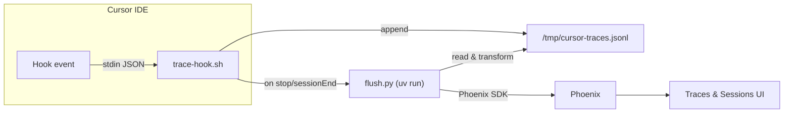

# cursor-insights

Session tracing and observability for Cursor AI agents, powered by [Phoenix](https://github.com/Arize-ai/phoenix).

Every agent interaction — prompts, tool calls, file edits, shell commands, thinking steps — is captured automatically and sent to Phoenix for search, replay, and analysis.

## How it works



**Hot path (~5 ms):** Every Cursor hook event is piped to `trace-hook.sh`, a bash script that appends the raw JSON to a local buffer file.

**Flush (on session end):** When a session ends, `flush.py` runs in the background via `uv run`. It reads the buffer, groups events into per-turn traces with proper parent-child relationships, maps them to [OpenInference](https://github.com/Arize-ai/openinference) semantic conventions, and sends them to Phoenix.

**Result:** Each conversation turn becomes a separate trace in Phoenix. All turns from the same Cursor tab are grouped into a Phoenix session, giving you a full conversational thread view.

## What gets captured

| Hook event | Span name | Content |
|---|---|---|
| `sessionStart` | `session` | Composer mode, background agent flag |
| `beforeSubmitPrompt` | *(first 120 chars of prompt)* | Full prompt text, attachments |
| `afterAgentThought` | `thinking` | Agent's reasoning text |
| `postToolUse` | `tool:<name>` | Tool input and output |
| `postToolUseFailure` | `tool:<name>.error` | Error message, failure type |
| `afterShellExecution` | `shell` | Command and output |
| `afterMCPExecution` | `mcp:<name>` | MCP tool input and result |
| `afterFileEdit` | `edit:<filename>` | File path and edits |
| `afterAgentResponse` | `response` | Agent's final response |
| `preCompact` | `compaction` | Context usage stats |
| `subagentStop` | `subagent:<type>` | Task, summary, tool count |
| `stop` / `sessionEnd` | `session.end` | Status, reason, duration |

## Quick start

### Prerequisites

- **macOS or Linux**
- **Docker** (for local Phoenix — optional if you have an existing instance)

`uv` is installed automatically if not already present.

### Install

```bash
git clone https://github.com/stelian-matei/cursor-insights.git
cd cursor-insights
bash install.sh
```

The installer will:

1. Install `uv` if needed
2. Copy hook scripts to `~/.cursor/hooks/`
3. Merge hook config into `~/.cursor/hooks.json`
4. Ask how you want to connect to Phoenix:
   - **Local Docker** — spins up Phoenix v13.15.0
   - **Existing URL** — connects to your Phoenix instance
   - **Skip** — configure later
5. Ask for a Phoenix project name (default: `cursor`)

After install, Cursor will trace all agent sessions automatically.

### Verify

Open Phoenix at [http://localhost:6006](http://localhost:6006) (or your custom URL), start a Cursor agent conversation, and watch traces appear in the project.

## Configuration

All settings are in `~/.cursor/hooks/.cursor-insights.env`:

```bash
PHOENIX_HOST="http://localhost:6006"
PHOENIX_PROJECT="cursor"
# CURSOR_TRACES_DEBUG="true"
# CURSOR_TRACES_SKIP="field1,field2"
# CURSOR_TRACES_BUFFER="/tmp/cursor-traces.jsonl"
```

| Variable | Default | Purpose |
|---|---|---|
| `PHOENIX_HOST` | `http://localhost:6006` | Phoenix server URL |
| `PHOENIX_PROJECT` | `cursor` | Phoenix project name |
| `CURSOR_TRACES_DEBUG` | *(unset)* | Set to `true` for debug logging to `/tmp/cursor-traces.log` |
| `CURSOR_TRACES_SKIP` | *(unset)* | Comma-separated field names to redact from traces |
| `CURSOR_TRACES_BUFFER` | `/tmp/cursor-traces.jsonl` | Path to the event buffer file |

## Manual flush

Traces flush automatically when a session ends. To flush manually:

```bash
uv run ~/.cursor/hooks/flush.py
```

With debug output:

```bash
CURSOR_TRACES_DEBUG=true uv run ~/.cursor/hooks/flush.py
```

Check buffer size:

```bash
wc -l /tmp/cursor-traces.jsonl
```

## Phoenix features

### Traces

Each user turn (prompt + agent response cycle) becomes a trace. Tool calls, file edits, and shell executions appear as child spans with proper input/output attribution.

### Sessions

All turns from the same Cursor conversation are grouped into a Phoenix session. The Sessions tab shows the conversational thread with first input and last output for each turn.

### Golden datasets

Save exemplary traces to Phoenix datasets for future reference — proven prompt patterns, successful tool chains, or reference workflows. See the [cursor-insights skill](skills/insights/SKILL.md) for programmatic examples.

## Uninstall

```bash
bash uninstall.sh
```

This removes hook scripts and config entries. Optionally stops the Phoenix container and removes its data volume.

## Architecture

```
~/.cursor/
├── hooks.json                    # Cursor hook config (managed by installer)
└── hooks/
    ├── trace-hook.sh             # Bash hot-path: buffers events (~5ms)
    ├── flush.py                  # Python: transforms & sends to Phoenix
    └── .cursor-insights.env      # User settings (Phoenix URL, project, etc.)
```

- **trace-hook.sh** runs for every hook event. It sources `.cursor-insights.env`, appends the JSON payload to the buffer, and triggers `flush.py` on `stop`/`sessionEnd`.
- **flush.py** runs via `uv run` (isolated Python with `arize-phoenix-client`). It reads the buffer, splits events into turns, builds OpenInference-compliant spans, and posts them to Phoenix.
- **Buffer file** (`/tmp/cursor-traces.jsonl`) acts as a resilient intermediary. If Phoenix is unreachable, the buffer is preserved for retry.

## Contributing

1. Fork the repo
2. Make your changes
3. Test with a real Cursor session
4. Submit a PR

## License

[MIT](LICENSE)
